# JAVA

## 一.变量与运算符

### 1.1标识符的使用

标识符的命名规则

- 由a-z，A-Z，_或$组成
- 其它同理c++

标识符的命名规范

- 包名：多单词组成时所有字母小写：xxxyyyzzz
  例如：java.lang、com.atguigu.bean
- 类名、接口名：多单词组成时下，所有单词的首字母大写：XxxYyyZzz
  例如：HelloWorld、String、System等
- 变量名、方法名：多单词组成时，第一个单词首字母小写，第二个单词开始每个单词首字母大写
  例如：bookName
- 常量名：所有字母都大写，多单词时每个单词用下划线连接：
  例如：MAX_VALUE

### 1.2变量

变量声明：数据类型 变量名 = 变量值

Java中的变量按照数据类型分类：

- 整型：byte\short\int\long（声明long类型变量时，需要提供后缀。后缀为'l'或'L'）,例如：`long l1 = 123123123L`

- 浮点数：float\double（double比float精度高，用double）
  声明float类型变量时，需要提供后缀。后缀为'f'或'F'，例如：`float f1 = 12.3f`

  - ##### 浮点型精度的说明

    ​	并不是所有小数都可以精确的用二进制浮点数表示。二进制浮点数不能精确的表示0.1、0.01、0.001这样的10的负次幂

    ​	浮点类型float、double的数据不适合在**不允许舍入误差**的金融计算领域。如果需要**精确**数字计算或保留指定位数精度，需要使用**BigDecimal类**

- 字符型：char（占2个字节）
  Java中的所有字符都使用Unicode编码，故一个字符可以存储一个字母，一个汉字，或其他书面语的一个字符

- 布尔型：boolean

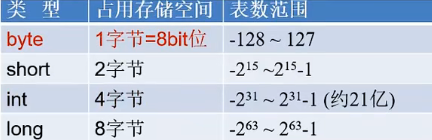


#### 1.2.1补充:计算机存储单元

- **字节（Byte）**：是计算机用于**计量存储容量**的**基本**单位，一个字节等于8bit
- **位（bit）：**是数据存储的**最小**单位。二进制数系统中，每个0火1就是一个位，叫做bit（比特），其中8bit就称为一个字节（Byte）
- **转换关系**
  - 8bit = 1Byte
    - 1024Byte = 1KB
  - 1024KB = 1MB
  - 1024MB = 1GB
  - 1024GB = 1TB

#### 1.2.2字符型变量

##### 1.2.2.1三种形式

1. 使用单引号('')括起来的**单个字符**
   例如:`char c1 = 'a'`、`char c2 = '中'`、`char c3 = '9'`
2. 直接使用**Unicode值**来表示字符型常量：`'\uXXX'`。其中，XXXX代表一个十六进制整数。
   例如：\u0023表示'#'。
3. Java中还允许使用转义字符'\'来将其后的字符
4. 使用具体字符对应的数值（比如ASCII码）`char c11 = '1'`

#### 1.2.3String类

- String声明的字符串内，可以包含0个、1个或多个字符

- **String与基本数据类型变量**只能做连接运算，使用”+“表示

- 运算的结果是String类型

- 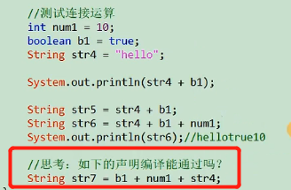
  不能

- 如何将String类型的变量转换为基本数据类型？
  使用Integar

  ```python
  public class GuessNumber{
      public static void main (String args[]) {
          int num2 = 10;
          String str9 = num2+"";
          int num3 = Integer.parseInt(str9);
          System.out.println(num2);
          System.out.println(num3);
      }
  }
  ```

  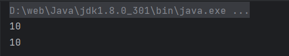

#### 1.2.4面试题

##### 1.2.4.1高效的方式计算2*8的值

2<<3

##### 1.2.4.2&和&&的区别

&：不管前面的条件是否正确，后面都执行。

&&：前面条件正确时，才执行后面，不正确时，就不执行

##### 1.2.4.3Java开发中计算金额使用什么数据类型

不能使用float或double，因为精度不高

使用BigDecimal类替换，可以实现任意精度的数据的运算

##### 1.2.4.4代码分析

```python
short s1 = 1；
s1 = s1+1；//有什么错？   =右边是int类型，需要强转
```

```
short s1 = 1；
s1+= 1；//有什么错？   没错
```

##### 1.2.5boolean占几个字节

> 编译时不谈占几个字节。
>
> 但是JVM在给boolean类型分配内存空间时，boolean类型的变量占据一个槽位（slot，等于4个字节）。
>
> > 拓展：在内存中：byte\short\char\boolean\int\float:占用1个slot
> >
> > double\long：占用2个slot

##### 1.2.6为什么Java中0.1+0.2结果不是0.3？

采用了**IEEE 754**标准


## 二.流程控制

### 2.1使用Scanner类从键盘中获取数据

步骤：

1. 导包`import java.util.Scanner`
2. 提供（或创建）一个Scanner类的实例
3. 调用Scanner类中的方法，获取指定类型的变量
4. 关闭资源，调用Scanner类的close()

注意：Scanner类中提供了获取byte\short\int\long\float\double\boolean\String类型变量的方法。

但没有提供获取char类型变量的方法。需要使用Scanner类next().charAt(0)

```java
//导包`import java.util.Scanner`
import java.util.Scanner;
public class Test1{
    public static void main (String args[]) {
        //提供（或创建）一个Scanner类的实例
        Scanner scan = new Scanner(System.in);
        System.out.println("欢迎光临xxx交友网");
        System.out.print("请输入你的网名：");
        //调用Scanner类中的方法，获取指定类型的变量
        String name = scan.next();
        System.out.print("请输入你的年龄：");
        int age = scan.nextInt();
        System.out.print("请输入你的体重：");
        double weight = scan.nextDouble();
        System.out.print("你是否单身（单身：true；不单身：false）：");
        boolean isSingle = scan.nextBoolean();
        System.out.print("请输入你的性别：（男/女）：");
        char gender = scan.next().charAt(0);
        System.out.println("网名：" + name + "，年龄："+age+"，体重:"+weight+"，是否单身："+isSingle+"，性别："+gender);
        System.out.println("注册完成，欢迎继续进入体验");
        //关闭资源，调用Scanner类的close()
        scan.close();
    }
}
```

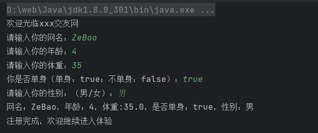

### 2.2如何获取一个随机数

1. 可以使用Java提供的API:Math类的random
2. random()调用以后，会返回一个[0.0,1.0)范围的double型的随机数

需求1：获取一个[0,100]范围的随机整数

```java
public class Test1{
    public static void main (String args[]) {
        double d1 = Math.random();
        System.out.println("d1 = " + d1);
        int num1 = (int)(Math.random()*101);
        System.out.println("num1 = " + num1);
    }
}
```

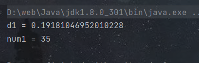

需求2：获取一个[a,b]范围的随机整数？

```java
(int)(Math.random() * (b - a + 1)) + a;
```

## 三.数组

### 3.1一维数组

数组特点：

- 数组中的元素在内存中是依次紧密排列的，有序的。

- 数组，属于引用数据类型的变量。数组的元素，既可以是基本数据类型，也可以引用数据类型。

- 数组，一旦初始化完成，其长度就确定了，且其长度不可更改

- 创建数组对象会在内存中开辟一整块’连续的空间‘。

  初始化：

  ```java
  public class Test1{
      public static void main(String args[]){
          //1.1 声明数组
          double[] prices;
          //1.2 数组的初始化
          //静态初始化：数组变量的赋值与数组元素的赋值操作同时进行。
          prices = new double[]{20.32,43.21,43.22};
          //数组的声明和初始化
          //动态初始化：数组变量的赋值与数组元素的赋值操作分开进行
          String[] foods = new String[4];
      }
  }
  ```

  

一维数组的内存解析：

- 将内存区划分为5个部分：程序计数器、虚拟机栈、本地方法栈、堆、方法区
- 与目前数组相关的内存结构：`int[] arr = new int[]{1,2,3};`
  虚拟机栈：用于存放方法中声明的变量。比如：arr
  堆：用于存放数组的实体（即数组中的所有元素）。比如：1，2，3

### 3.2二维数组

#### 3.2.1数组元素的默认初始化值

动态初始化方式1：（比如：`int[][] arr = new int[3][4]`）

```java
public class Test1{
    public static void main(String args[]){
        //数组元素的默认初始化值
        int[][] arr1 = new int[3][2];
        //外层元素默认值：
        System.out.println(arr1[0]);//[I@1b6d3586
        System.out.println(arr1[1]);//[I@4554617c
        //内存元素默认值：
        System.out.println(arr1[0][0]);//0
    }
}
```

- 外层元素，默认存储地址值
- 内层元素，默认与以为数组元素的不同类型的默认值规定相同
  - 整型数组元素的默认初始化值：0
  - 浮点型数组元素的默认初始化值：0.0
  - 字符型数组元素的默认初始化值：0（或理解为'\u0000'）
  - boolean型数组元素的默认初始化值：false
  - 引用数据类型数组元素的默认初始化值：null

动态初始化方式2：（比如：`int[][] arr = new int[3][4]`）

```java
int[][] arr2 = new int[4][];
        //外层元素默认值：
        System.out.println(arr2[0]);//null
        //内存元素默认值：
        System.out.println(arr2[0][0]);//报错
```


- 外层元素：默认存储null
- 内层元素，不存在的。如果调用会报错

#### 3.2.2二维数组内存解析

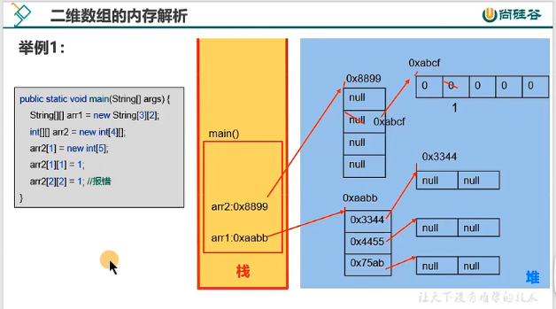

### 3.3Arrays工具类的使用

java.util.Arrays类即为操作数组的工具类，包含了用来操作数组（比如排序和搜索）的各种方法。比如：

- 数组元素拼接
  - static String toString(int[] a)：字符串表示形式由数组的元素列表组成，括在方括号("[]")中。相邻元素字符"，"（逗号加空格）分隔。形式为：[元素1,元素2,元素3。。。]
  - static String toString(Object[] a)：字符串表示形式由数组的元素列表组成，括在方括号("[]")中。相邻元素用字符', '(逗号加空格)分隔。元素将自动调用自己从Object继承的toString方法将对象转为字符串进行拼接，如果没有重写，则返回类型@hash值，如果重写则按重写返回的字符串进行拼接。
- 数组排序
  - static void sort(int[] a)：将a数组按照从小到大进行排序
  - static void sort(int[] a,int fromIndex,int toIndex)：将a数组的[fromIndex,int toIndex)部分按照升序排列
  - static void sort(Object[] a)：根据元素的自然顺序对指定对象数组按升序进行排序。
  - static <T> void sort(T[] a,Comparator<? super T>c):根据指定比较器产生的顺序对指定对象进行排序

```java
import java.util.Arrays;

public class Test1{
    public static void main(String args[]){
        //1.boolean equals(int[] a,int[] b):比较两个数组的元素是否依次相等
        int[] arr1 = new int[]{1,2,3,4,5};
        int[] arr2 = new int[]{1,2,3,4,5};
        System.out.println(arr1 == arr2);//false
        boolean isEquals = Arrays.equals(arr1,arr2);
        System.out.println(isEquals);//true
        //2. String toString(int[] a):输出数组元素信息。
        System.out.println(arr1);//[I@1b6d3586
        System.out.println(Arrays.toString(arr1));//[1, 2, 3, 4, 5]
        //3.void fill(int[] a,int val):将指定值填充到数组之中。
        Arrays.fill(arr1,10);
        System.out.println(Arrays.toString(arr1));//[10, 10, 10, 10, 10]
        //4. void sort(int[] a):使用快速排序算法实现的排序
        int[] arr3 = new int[]{34,54,3,2,65,7,34,5,76,34,67};
        Arrays.sort(arr3);
        System.out.println(Arrays.toString(arr3));//[2, 3, 5, 7, 34, 34, 34, 54, 65, 67, 76]
        //5. int binarySearch(int[] a,int key)：二分查找
        //使用前提：当前数组必须是有序的
        Arrays.binarySearch(arr3,5);
        int index = Arrays.binarySearch(arr3,5);
        System.out.println(index);//2
     }
}
```


1. 数组的使用中常见的异常小结
   - 数组角标越界的异常：ArrayIndexOutOfBoundsException
   - 空指针的异常：NullPointerException

### 3.4小结

1. 为什么数组要从0开始编号，而不是1
   数组的索引，表示了数组元素距离首地址的偏移量

## 四.面向对象（基础）

### 4.1类的实例化与对象的内存解析

- 属性：该类是无的状态信息。对应类中的成员变量
  成员变量<=>属性<=>Field
- 行为：该类事物需要什么操作，或者基于事物的状态能做什么。对应类中的成员方法
  成员方法<=>函数<=>Method

#### 4.1.1类的实例化

格式：类类型 对象名 = 通过new创建的对象实体

举例：

`Phone p1 = new Phone();`

`Scanner scan = new Scanner(System.in);`

`String str = new String()；`

#### 4.1.2面向对象完成具体功能的操作的三步流程（非常重要）

步骤1：创建类，并设计类的内部成员（属性、方法）

步骤2：创建类的对象。比如：Phone p1 = new Phone();

步骤3：通过对象，调用其内部声明的属性或方法，完成相关的功能

```java
//Phone.java
public class Phone{
   //属性
    String name;//品牌
    double price;//价格
    //方法
    public void call(){
        System.out.println("手机能拨打电话");
    }
    public void sendMessage(String message){
        System.out.println("发送短信："+message);
    }
    public void playGame(){
        System.out.println("手机可以玩游戏");
    }
}
```

```java
//PhoneTest.java
public class PhoneTest {//是Phone类的测试类
    public static void main(String[] args){
        //创建Phone的对象
        Phone p1 = new Phone();
        //通过Phone的对象，调用其内部声明的属性或方法
        //格式：”对象.属性“或”对象.方法“
        p1.name = "huawei mate60";
        p1.price = 6999;
        System.out.println("name = " + p1.name + ",price = " + p1.price);
        //调用方法
        p1.call();
    }
}
```


#### 4.1.3对象在内存中的分配涉及到的内存结构（理论）

- 栈(stack)：方法内定义的变量，存储在栈中。
- 堆(heap)：new出来的结构（比如：数组实体、对象的实体）。包括对象的属性
- 方法区(method area)：存放类的模板。比如： Person类的模板

#### 4.1.4创建类的一个对象，属性赋值

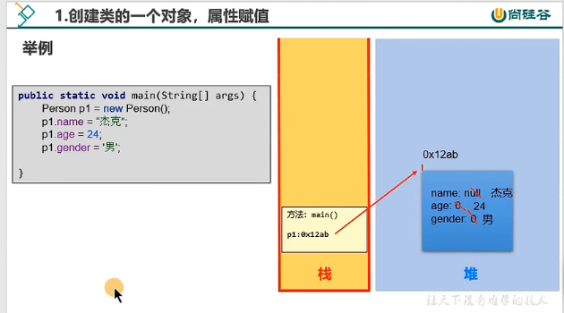

#### 4.1.5创建类的多个对象，属性赋值

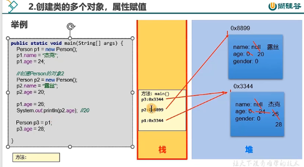

### 4.2成员变量与局部变量

#### 4.2.1变量的分类

- 角度一：按照数据类型来分：基本数据类型（8种）、引用数据类型（数组、类、接口、注解、记录）
- 角度二：按照变量在类中声明的位置：成员变量（或属性）、局部变量（方法内、方法形参、构造器内、构造器形参、代码块内等）
  - 方法体外，类体内声明的变量称为成员变量。
  - 在方法体内部等位置声明的变量称为局部变量。

#### 4.2.2属性的几个称谓

成员变量、属性、field（字段、域）

#### 4.2.3区分 成员变量VS局部变量

相同点：

- 变量声明的格式相同：数据类型 变量名 = 变量值
- 变量都有其有效的作用域。出了作用域就失效了。
- 变量须先声明后赋值再使用

不同点：

- 类中声明的位置的不同
  - 属性：声明在类内，方法外的变量
  - 局部变量：声明方法、构造器内部的变量
- 在内存中分配的位置不同（难）
  - 属性：随着对象的创建，存储在堆空间中。
  - 局部变量：存储在栈空间中
- 声明周期：
  - 属性：随着对象的创建而创建，随着对象的消亡而消亡。
  - 局部变量：随着方法对应的栈帧入栈，局部变量会在栈中分配；随着方法对应的栈帧出栈，局部变量消亡。
- 作用域：
  - 属性：在整个类的内部都是有效的
  - 局部变量：仅限于声明此局部变量所在方法（或构造器、代码块）中
- 是否可以有权限修饰符进行修饰：
  - 都有哪些权限修饰符：public、protected、缺省、private（用于表面所修饰的结构可调用的范围的大小）
  - 属性：是可以使用权限修饰符进行修饰的
  - 局部变量：不能使用权限修饰符进行修饰的
- 是否有默认值：（重点）
  - 属性：都有默认初始化值
  - 局部变量：都没有默认初始化值

### 4.3类的成员之二：方法（method）

- 方法是类或对象行为特征的抽象，用来完成某个功能操作。在某些语言中也称为'函数'或过程。
- 将功能封装为方法的目的是，可以**实现代码重用，减少冗余，简化代码**
- Java里的方法**不能独立存在**，所有的方法必须定义在类里

#### 4.3.1使用举例

- Math.random()的random()方法
- Math.sqrt(x)的sqrt(x)方法
- System.out.println(x)的println(x)方法
- new Scanner(System.in).nextInt()的nextInt()方法
- Arrays类中的binarySearch()方法、sort()方法、equals()方法

### 4.4对象数组的使用

```java
//Student.java
public class Student {
    //属性
    int number;
    int state;
    int score;
    //声明一个方法：显示学生的属性信息
    public String show(){
        return "number："+number + ",state："+state + ",score"+score;
    }
}
```

```java
//StudentTest.java
public class StudentTest{
   public static void main (String[] args){
       //创建Student[]
        Student[] students = new Student[20];
        //使用循环，给数组的元素赋值
        for (int i = 0; i < students.length; i++){
            students[i] = new Student();
            //给每一个学生对象的number、state、score属性赋值
            students[i].number = i + 1;
            students[i].state = (int)(Math.random()*6+1);
            students[i].score = (int)(Math.random()*101);
        }
        //需求1：打印3年级的学生信息
        for(int i = 0;i<students.length;i++){
            if(3 == students[i].state){
                Student stu = students[i];
                System.out.println(stu.show());
            }
        }
        //需求2：使用冒泡排序按学生成绩排序，并遍历所有学生信息
       for(int i = 0;i<students.length-1;i++)
           for(int j = 0;j<students.length-1-i;j++){
               if(students[j].score>students[j+1].score){
                   Student temp = students[j];
                   students[j] = students[j + 1];
                   students[j + 1] = temp;
               }
           }
    }
}

```

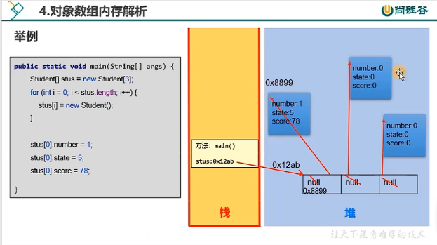

### 4.5方法应用

#### 4.5.1方法的重载(overload)

1. 定义：在同一个类中，允许存在一个以上的同名方法，只要它们的参数列表不同即可。满足这样特征的多个方法，彼此之间构成方法的重载
2. 总结为”两同一不同“
   两同：类名、方法名
   一不同：参数列表不同。①参数个数不同②参数类型不同
   注意：方法的重载与形参的名、权限修饰符、返回值类型都没有关系


**println()方法重载，当时char类型的时候会直接打印出来**

#### 4.5.2可变个数形参的方法(jdk5.0)

1. 使用场景
   在调用方法时，可能会出现方法形参类型是确定的，但是参数个数不确定。此时，我们就可以使用可变个数的方法
2. 格式：(参数类型...参数名)
3. 说明：
   1. 可变个数形参的方法在调用时，针对于可变的形参赋的实参个数可以是0个、1个或多个
   2. 可变个数形参的方法与同一个类中，同名的多个方法之间可以构成重载
   3. 特例：可变个数形参的方法与同一类中方法名相同，且与可变个数形参类型相同的**数组**参数不构成重载
   4. 可变个数的形参必须声明在形参列表的最后
   5. 可变个数的形参最多在一个方法的参数列表中出现一次

```java
public class StringConnect{
   public static void main (String[] args){
       StringConnect test = new StringConnect();
       String info = test.connect("-","hello","world");//hello-world
       System.out.println(info);
       System.out.println(test.connect("/","hello"));//hello
}

public String connect(String operator,String ... strs){
       String result = "";
       for(int i = 0;i < strs.length;i++){
           if(i == 0){
               result += strs[i];
           }
           else{
               result += (operator + strs[i]);
           }
       }
       return result;
   }
}

```

### 4.6方法的值传递机制

1. 对于方法内声明的局部变量来说：如果出现赋值操作
   - 如果是基本数据类型的变量，则将此变量保存的数据值传递出去
   - 如果是引用数据类型的变量，则将此变量保存的地址值传递出去
2. 规则：实参给形参赋值的过程
   - 如果形参是**基本**数据类型的变量，则将实惨保存的**数据值**赋给形参
   - 如果形参是**引用**数据类型的变量，则将实参保存的**地址**赋给形参

正确的swap函数

```java
public void swap(int[] arr,int i,int j){
	int temp = arr[i];
	arr[i] = arr[j];
	arr[j] = temp;
}
```

### 4.7package与import关键字的使用

#### 4.7.1包的作用：

- 包可以包含类和子包，划分项目层次，便于管理
- 帮助管理大型文件系统：将功能相近的类划分到同一包中。比如：MVC的设计模式
- 解决类命名冲突的问题
- 控制访问权限

#### 4.7.2JDK中主要的包

`java.lang`----包含一些Java语言的核心类，如String、Math、Integar、System和Thread，提供常用功能

`java.net` ----包含执行与网络相关的操作的类和接口

`java.io` ----包含能提供多种输入/输出功能的类

`java.util`----包含一些实用工具类，如定义系统特性、接口的集合框架类、使用与日期日历相关的函数。

`java.text` ---- 包含了一些java格式化相关的类

`java.sql` ----包含了java进行JDBC数据库的相关类/接口

`java.awt` ----包含了构成抽象窗口工具集(abstract window toolkits)的多个类，这些类被用来构造和管理

#### 4.7.3import关键字的使用

- 如果使用`a.*`导入结构，表示可以导入a包下的所有的结构。举例：可以使用java.util.*的方式，一次性导入util
- 如果已经导入java.a包下的类，那么如果需要使用a包下的类的话，仍然需要导入

#### 4.7.4封装性练习

创建程序，在其中定义两个类：Person和PersonTest类。定义如下：

用setAge()设置人的合法年龄(0~130)，用getAge()返回人的年龄

在PersonTest类中实例化Person类的对象b，调用setAge()和getAge()方法，体会Java的封装性

```java
//Person.java
public class Person{
    private int age;
    //设置age属性
    public void setAge(int a){
        if(a>=0 && a <= 130){
            age = a;
        }else{
            System.out.println("你输入的数据非法");
        }
    }
    //获取age属性
    public int getAge(){
        return age;
    }
}

```

```java
//PersonTest.java
public class PersonTest {
    public static void main(String[] args){
        //创建Person实例1
        Person p1 = new Person();
        //p1.age = 10;//编译不通过
        p1.setAge(20);
        System.out.println(p1.getAge());
    }
}

```

### 4.8构造器的使用及练习

#### 4.8.1构造器的作用

1. 搭配new关键字，建类的对象
2. 在创建对象的同时，可以给对象的相关属性赋值

#### 4.8.2构造器的使用说明

1. 构造器声明的格式：权限修饰符 类名(形参列表){} 
2. 创建类以后，在没有显示提供任何构造器的情况下，系统会默认提供一个空参的构造器，且构造器的权限与类声明的相同
3. 一旦类中显示声明了构造器，则系统不再提供默认的空参的构造器
4. 一个类中可以声明多个构造器，彼此之间构成重载

### 4.9类中属性（当前仅考虑实例变量）赋值过程

1. 在类的属性中，可以有哪些位置给属性赋值
   1. 默认赋值
   2. 显式赋值
   3. 构造器中赋值
   4. 通过”对象.方法“的方式赋值
   5. 通过”对象.属性“的方式赋值
2. 这些位置执行的先后顺序是怎样？
   - ① - ② - ③ - ④/⑤
3. 以上操作在对象创建过程中可以执行的次数如何？
   - 只能执行一次：①、②、③
   - 可以多次执行：④、⑤

4.9.1 JavaBean的理解

JavaBean是指符合如下标准的Java类：

- 类是公共的
- 有一个无参的公共的构造器
- 有属性，且有对应的get、set方法

#### 4.9.1UML类图

UML(Unified Modeling Language，统一建模语言)，用来描述**软件模型**和**架构**的图形化语言

常用的UML工具软件有PowerDesinger、Rose、和Enterprise Architect。

UML工具软件不仅可以绘制软件开发中所需的各种图表，还可以生成对应的源代码

在软件开发中，使用**UML类图**可以更加直观地描述类内部结构（类的属性和操作）以及类之间的关系（如关联、依赖、聚合等）。

+表示public类型，-表示private类型，#表示protected类型

方法的写法：
方法的类型(+、-)方法名（参数名：参数类型）：返回值类型

斜体表示抽象方法或类。

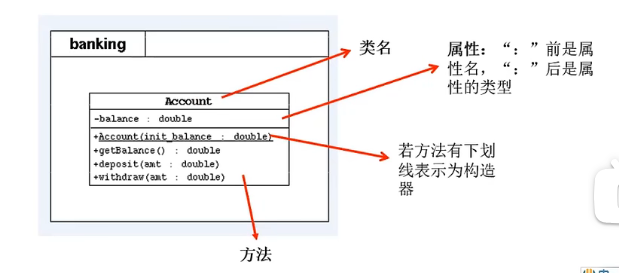

### 4.10小结

#### 4.10.1Java中内存结构划分

- Java中内存结构划分为：虚拟机栈、堆、方法区；程序计数器、本地方法栈
- 虚拟机栈：以栈帧为基本单位，有入栈和出栈操作；每个栈帧入栈操作对应一个方法的执行；方法内的局部变量会存储在栈帧中。
- 堆空间：new出来的结构（数组、对象）：①数组，数组的元素在堆中 ②对象的成员变量在堆中
- 方法区：加载的类的模板结构

#### 4.10.2构造方法和普通方法的区别

编写代码的角度：没有共同点。声明格式、作用都不同。

字节码文件的角度：构造器会以<init>()方法的形态呈现


## 五.面向对象（进阶）

### 5.1this关键字的使用

#### 5.1.1目前可能出现的问题及解决方案？

我们在声明一个属性对应的setXxx方法时，通过形参给对应的属性赋值。如果形参名和属性名同名了，那么该如何在方法内区分这两个变量呢？

解决方案：使用this。具体来讲，使用this修饰的变量，表示的是属性。没有this修饰的，表示的是形参

```java
class Person{
    //设置age属性
    int age;
    public void setAge(int age){
        this.age = age;
    }
    //获取age属性
    public int getAge(){
        return age;
    }
}
```

#### 5.1.2this可以调用的结构

成员变量、方法、构造器

#### 5.1.3this的理解

当前对象（在方法中调用时）或当前正在创建的对象（在构造器中调用时）

#### 5.1.4this调用属性和方法

针对于方法内的使用情况：（准确的说是非static修饰的方法）

一般情况：我们通过对象a调用方法，可以在方法内调用当前对象a的属性或其他方法。此时，我们可以在属性和其他方法前使用“this.”，表示当前属性或方法所属的对象a。但是，一般情况下，我们都选择省略此“this.”结构。

特殊情况：如果方法的形参与对象的属性同名了，我们必须使用"this."进行区分。使用this.修饰的变量即为属性（或成员变量），没有this.修饰的变量，即为局部变量

针对构造器内的使用情况：

一般情况：我们通过构造器创建对象时，可以在构造器内调用当前正在创建的对象的属性或方法。此时，我们可以在属性和方法前使用“this.”，表示当前属性或方法所属的对象。但是，一般情况下，我们都选择省略此“this.”结构。

特殊情况：如果构造器的形参与对象的属性同名了，我们必须使用"this."进行区分。使用this.修饰的变量即为属性（或成员变量），没有this.修饰的变量，即为局部变量

#### 5.1.5this调用构造器

格式：`this(形参列表)`

我们可以在类的构造器中，调用当前类中指定的其它构造器

要求：`this(形参列表)`必须声明在当前构造器的首行

结论：`this(形参列表)`在构造器最多声明一个。如果一个类中声明了n个构造器，则最多有n-1个构造器可以声明有`this(形参列表)`的结构

```java
class User{
    //设置age属性
   String name;
   int age;
   public User(){
    //模拟对象创建时，需要初始化50行代码
   }
   public User(String name){
       this();
       this.name = name;
   }
   public User(String name,int age){
       this(name);
       //this.name = name;
       this.age = age;
   }
}
```

练习：

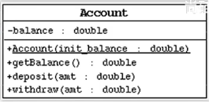

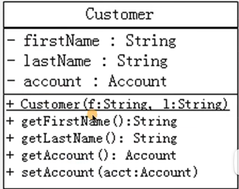

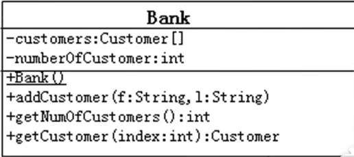

```java
//Account.java
public class Account{
    private double balance;//余额

    public Account(double init_balance) {
        this.balance = init_balance;
    }

    public double getBalance() {
        return balance;
    }
    //存钱
    public void deposit(double amt){
        if(amt>0){
            balance += amt;
            System.out.println("成功存入：" + amt);
        }
    }
    //取钱
    public void  withdraw(double amt){
        if(balance >= amt && amt >0){
           balance -= amt;
           System.out.println("成功取出：" + amt);
        }else{
            System.out.println("取款数额有误或余额不足");
        }
    }
}

```

```java
//BankTest.java
public class BankTest {
    public static void main(String[] args){
        Bank bank = new Bank();
        bank.addCustomer("三","张");
        bank.addCustomer("四","李");
        bank.getCustomer(0).setAccount(new Account(1000));
        bank.getCustomer(0).getAccount().withdraw(50);
        System.out.println("账户余额为："+bank.getCustomer(0).getAccount().getBalance());
    }
}

```

```java
//Bank.java
public class Bank {
    private Customer[] customers;//用于保护多个客户
    private int numberOfCustomer;//用于记录存储的客户的个数
    public Bank(){
        customers = new Customer[10];
    }
    //将指定姓名的客户保存在银行的客户列表中
    public void addCustomer(String f,String l){
        Customer cust = new Customer(f,l);
        customers[numberOfCustomer++] = cust;
    }
    //获取指定索引位置上的客户
    public int getNumOfCustomer(){
        return  numberOfCustomer;
    }

    public Customer getCustomer(int index){
        if(index < 0 || index >= numberOfCustomer){
            return null;
        }else {
            return customers[index];
        }
    }
}

```

```java
//Customer.java
public class Customer {
    private String firstName;//名
    private String lastName;//姓
    private Account account;//账户

    public Customer(String f, String l) {
        this.firstName = f;
        this.lastName = l;
    }

    public String getFirstName() {
        return firstName;
    }

    public String getLastName() {
        return lastName;
    }

    public Account getAccount() {
        return account;
    }

    public void setAccount(Account account) {
        this.account = account;
    }
}


```

#### 5.1.6 项目一：拼电商客户管理系统的演示及代码实现

##### 需求说明

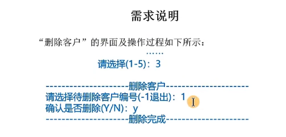


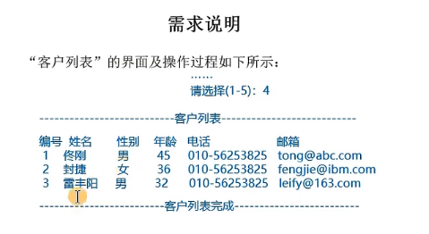

##### 软件设计结构

该软件由以下三个模块组成：

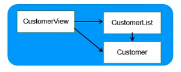

- CustomerView为主模块，负责菜单的显示和处理用户操作
- CustomerList为Customer对象的管理模块，内部用数组管理一组Customer对象，并提供相应的添加、修改、删除和遍历方法，供CustomerView调用
- Customer为实体对象，用来封装客户信息

##### 第1步-Customer类的设计

- Customer为实体类，用来封装客户信息
- 该类封装客户的以下信息：
  - `String name`:
  - `char gender`:
  - `int age`:
  - `String phone`:
  - `String email`:
- 提供各属性的get/set方法
- 提供所需的构造器(可自行确定)

##### 第1步 - 实现Customer类

1. 按照设计要求编写Customer类，并编译
2. 在Customer类中临时添加一个main方法中，作为单元测试方法
   在方法中创建Customer对象，并调用对象的各个方法，以测试该类是否编写正确。

##### 第2步 - CustomerList类的设计

- CustomerList为Customer对象的管理模块，内部使用数组管理一组Customer对象
- 本类封装以下信息：
  - `Customer[] customers`:用来保存客户对象的数组
  - `int total = 0`:记录已保存客户对象的数量
- 该类至少提供以下构造器和方法：
  - `public CustomerList(int totalCustomer)`
    - ​	用途：构造器，用来初始化customers数组
      - ​	参数：totalCustomer:指定customers数组的最大空间
  - `public boolean addCustomer(Customer customer)`
    - ​	用途：将参数customer添加组中最后一个客户对象记录之后
      - ​	参数：customer指定要添加的客户对象
        - ​	返回：添加成功返回true;false表示数组已满，无法添加
  - `public boolean replaceCustomer(int index,Customer cust)`
    - ​	用途：用参数customer替换数组中由index指定的对象
      - ​	参数：customer指定替换的新客户对象
        - ​		index指定所替换对象在数组中的位置，从0开始
        - ​	返回：替换成功返回true;false表示索引无效，无法替换
        - 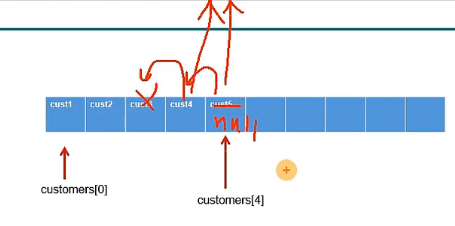
  - `public boolean deleteCustomer(int index)`
    - ​	用途：从数组中删除参数index指定索引位置的客户对象记录
      - ​	参数：index指定所删除对象在数组中的索引位置，从0开始
        - ​	返回：删除成功返回true，false表示索引无效，无法删除
    - `public Customer[] getAllCustomers()`
      - ​	用途：返回数组中记录的所有客户对象
        - ​	返回：Customer[]数组中包含了当前所有客户对象，该数组长度与对象个数相同。
    - `public Customer getCustomer(int index)`
      - ​	用途：返回参数index指定索引位置的客户对象记录
        - ​	参数：Index指定所要获取的客户在数组中的索引位置，从0开始
          - ​	返回：封装了客户信息的Customer对象
    - `public int getTotal()`

##### 第3步 - CustomerView类的设计

- CustomerView为主模块，负责菜单的显示和处理用户操作
- 本类封装以下信息：
  - `CustomerList customerList = new CustomerList(10);`
  - 创建最大包含10个客户对象的CustomerList对象，供以下各成员方法使用
- 该类至少提供以下方法：
  - `public void enterMainMenu()`
  - `private void addNewCustomer()`
  - `private void modifyCustomer()`
  - `private void deleteCustomer()`
  - `private void listAllCustomers()`
  - `public static void main(String[] args)`

```java
//CMUtility.java
import java.util.*;
/**
 CMUtility工具类：
 将不同的功能封装为方法，就是可以直接通过调用方法使用它的功能，而无需考虑具体的功能实现细节。
 */
public class CMUtility {
    private static Scanner scanner = new Scanner(System.in);
    /**
     用于界面菜单的选择。该方法读取键盘，如果用户键入’1’-’5’中的任意字符，则方法返回。返回值为用户键入字符。
     */
    public static char readMenuSelection() {
        char c;
        for (; ; ) {
            String str = readKeyBoard(1, false);
            c = str.charAt(0);
            if (c != '1' && c != '2' &&
                    c != '3' && c != '4' && c != '5') {
                System.out.print("选择错误，请重新输入：");
            } else break;
        }
        return c;
    }
    /**
     从键盘读取一个字符，并将其作为方法的返回值。
     */
    public static char readChar() {
        String str = readKeyBoard(1, false);
        return str.charAt(0);
    }
    /**
     从键盘读取一个字符，并将其作为方法的返回值。
     如果用户不输入字符而直接回车，方法将以defaultValue 作为返回值。
     */
    public static char readChar(char defaultValue) {
        String str = readKeyBoard(1, true);
        return (str.length() == 0) ? defaultValue : str.charAt(0);
    }
    /**
     从键盘读取一个长度不超过2位的整数，并将其作为方法的返回值。
     */
    public static int readInt() {
        int n;
        for (; ; ) {
            String str = readKeyBoard(2, false);
            try {
                n = Integer.parseInt(str);
                break;
            } catch (NumberFormatException e) {
                System.out.print("数字输入错误，请重新输入：");
            }
        }
        return n;
    }
    /**
     从键盘读取一个长度不超过2位的整数，并将其作为方法的返回值。
     如果用户不输入字符而直接回车，方法将以defaultValue 作为返回值。
     */
    public static int readInt(int defaultValue) {
        int n;
        for (; ; ) {
            String str = readKeyBoard(2, true);
            if (str.equals("")) {
                return defaultValue;
            }

            try {
                n = Integer.parseInt(str);
                break;
            } catch (NumberFormatException e) {
                System.out.print("数字输入错误，请重新输入：");
            }
        }
        return n;
    }
    /**
     从键盘读取一个长度不超过limit的字符串，并将其作为方法的返回值。
     */
    public static String readString(int limit) {
        return readKeyBoard(limit, false);
    }
    /**
     从键盘读取一个长度不超过limit的字符串，并将其作为方法的返回值。
     如果用户不输入字符而直接回车，方法将以defaultValue 作为返回值。
     */
    public static String readString(int limit, String defaultValue) {
        String str = readKeyBoard(limit, true);
        return str.equals("")? defaultValue : str;
    }
    /**
     用于确认选择的输入。该方法从键盘读取‘Y’或’N’，并将其作为方法的返回值。
     */
    public static char readConfirmSelection() {
        char c;
        for (; ; ) {
            String str = readKeyBoard(1, false).toUpperCase();
            c = str.charAt(0);
            if (c == 'Y' || c == 'N') {
                break;
            } else {
                System.out.print("选择错误，请重新输入：");
            }
        }
        return c;
    }

    private static String readKeyBoard(int limit, boolean blankReturn) {
        String line = "";

        while (scanner.hasNextLine()) {
            line = scanner.nextLine();
            if (line.length() == 0) {
                if (blankReturn) return line;
                else continue;
            }

            if (line.length() < 1 || line.length() > limit) {
                System.out.print("输入长度（不大于" + limit + "）错误，请重新输入：");
                continue;
            }
            break;
        }
        return line;
    }
}

```

```java
//Customer.java
public class Customer {
    private String name;
    private char gender;
    private int age;
    private String phone;
    private String email;

    public Customer() {
    }

    public Customer(String name, char gender, int age, String phone, String email) {
        this.name = name;
        this.gender = gender;
        this.age = age;
        this.phone = phone;
        this.email = email;
    }

    public String getName() {
        return name;
    }

    public void setName(String name) {
        this.name = name;
    }

    public char getGender() {
        return gender;
    }

    public void setGender(char gender) {
        this.gender = gender;
    }

    public int getAge() {
        return age;
    }

    public void setAge(int age) {
        this.age = age;
    }

    public String getPhone() {
        return phone;
    }

    public void setPhone(String phone) {
        this.phone = phone;
    }

    public String getEmail() {
        return email;
    }

    public void setEmail(String email) {
        this.email = email;
    }
}

```

```java
//CustomerList.java
public class CustomerList {
    private Customer[] customers;//用来保存客户对象的数组
    private int total;//记录已保存客户对象的数量
    /*用途：构造器，用来初始化customers数组
      参数：totalCustomer:指定customers数组的最大空间*/

    public CustomerList(int totalCustomer){
        customers = new Customer[totalCustomer];
    }
    public boolean addCustomer(Customer customer){
        if(total<customers.length) {
            customers[total] = customer;
            total++;
            return true;
        }
        return false;
    }

    /* 用途：用参数customer替换数组中由index指定的对象
	   参数：customer指定替换的新客户对象
  	   index指定所替换对象在数组中的位置，从0开始
       返回：替换成功返回true;false表示索引无效，无法替换 */
    public boolean replaceCustomer(int index,Customer cust){
        if(index >= 0 && index < total){
            customers[index] = cust;
            return true;
        }
        return false;
    }

    /* 用途：从数组中删除参数index指定索引位置的客户对象记录
       参数：index指定所删除对象在数组中的索引位置，从0开始
       返回：删除成功返回true，false表示索引无效，无法删除 */
    public boolean deleteCustomer(int index){
        if(index < 0 && index >= total){
            return false;
        }
        for(int i = index;i < total - 1;i++){
            customers[i] = customers[i+1];
        }
        customers[total - 1] = null;
        total--;
        return true;
    }

    /*用途：返回数组中记录的所有客户对象
	返回：Customer[]数组中包含了当前所有客户对象，该数组长度与对象个数相同。*/
    public Customer[] getAllCustomers(){
        //错误的：
 //       return customers;
        //正确的：
        Customer[] custs = new Customer[total];
        for(int i = 0;i < custs.length;i++)
        {
            custs[i] = customers[i];
        }
        return custs;
    }
    /*用途：返回参数index指定索引位置的客户对象记录

	参数：Index指定所要获取的客户在数组中的索引位置，从0开始
  	返回：封装了客户信息的Customer对象*/
    public Customer getCustomer(int index){
        if(index < 0 || index >= total){
            return null;
        }else {
            return customers[index];
        }
    }
    public int getTotal(){
        return total;
    }
}

```

```java
//CustomerView.java
public class CustomerList {
    private Customer[] customers;//用来保存客户对象的数组
    private int total;//记录已保存客户对象的数量
    /*用途：构造器，用来初始化customers数组
      参数：totalCustomer:指定customers数组的最大空间*/

    public CustomerList(int totalCustomer){
        customers = new Customer[totalCustomer];
    }
    public boolean addCustomer(Customer customer){
        if(total<customers.length) {
            customers[total] = customer;
            total++;
            return true;
        }
        return false;
    }

    /* 用途：用参数customer替换数组中由index指定的对象
	   参数：customer指定替换的新客户对象
  	   index指定所替换对象在数组中的位置，从0开始
       返回：替换成功返回true;false表示索引无效，无法替换 */
    public boolean replaceCustomer(int index,Customer cust){
        if(index >= 0 && index < total){
            customers[index] = cust;
            return true;
        }
        return false;
    }

    /* 用途：从数组中删除参数index指定索引位置的客户对象记录
       参数：index指定所删除对象在数组中的索引位置，从0开始
       返回：删除成功返回true，false表示索引无效，无法删除 */
    public boolean deleteCustomer(int index){
        if(index < 0 && index >= total){
            return false;
        }
        for(int i = index;i < total - 1;i++){
            customers[i] = customers[i+1];
        }
        customers[total - 1] = null;
        total--;
        return true;
    }

    /*用途：返回数组中记录的所有客户对象
	返回：Customer[]数组中包含了当前所有客户对象，该数组长度与对象个数相同。*/
    public Customer[] getAllCustomers(){
        //错误的：
 //       return customers;
        //正确的：
        Customer[] custs = new Customer[total];
        for(int i = 0;i < custs.length;i++)
        {
            custs[i] = customers[i];
        }
        return custs;
    }
    /*用途：返回参数index指定索引位置的客户对象记录

	参数：Index指定所要获取的客户在数组中的索引位置，从0开始
  	返回：封装了客户信息的Customer对象*/
    public Customer getCustomer(int index){
        if(index < 0 || index >= total){
            return null;
        }else {
            return customers[index];
        }
    }
    public int getTotal(){
        return total;
    }
}

```

### 5.2继承性

#### 5.2.1继承的理解

代码层面：

​	自上而下，定义了一个类A，在定义另一个类B时，发现类B的功能与类A相似，考虑B继承于类A

​	自下而上：定义了类B、C、D等，发现B、C、D有类似的属性和方法，则可以考虑将相同的属性和方法进行抽取，封装到类A中，让类B、C、D继承于类A，同时，B、C、D中的相似的功能就可以删除了

#### 5.2.2继承的好处

- 继承的出现减少了代码冗余，提高了代码的复用性
- 继承的出现，更有利于功能的扩展
- 继承的出现让类与类之间产生了'is - a'的关系，为多态的使用提供了前提
- 可见，父类更一般，子类更具体

#### 5.2.3格式

```java
class A{
	//属性、方法
}
class B extends A{

}
```

#### 5.2.4有了继承性以后：

子类就获取到了父类中声明的所有的属性和方法

但是，由于封装性的影响，可能子类不能直接调用父类中声明的属性或方法

子类在继承父类后，还可以扩展自己特有的功能，如增加特有的属性、方法

类只能单继承，和多层继承

案例：

(1)定义一个ManKind类，包括

- 成员变量int sex 和int salary
- 方法void manOrWoman()，根据sex的值显示"man"(sex == 1)或者"woman"(sex == 0)
- 方法void employeed()，根据salary的值显示"no job"(salary == 0)或者"job"(salary != 0)

(2)定义类Kids继承ManKind，并包括

- 成员变量int yearsOld;
- 方法printAge()打印yearsOld的值。

(3)定义类KidTest，在类的main方法实例化Kids的对象someKid，用该对象访问其父类的成员变量及方法。

```java
//ManKind.java
public class ManKind {
    private int sex;
    private int salary;

    public ManKind() {
    }

    public ManKind(int sex, int salary) {
        this.sex = sex;
        this.salary = salary;
    }

    public int getSex() {
        return sex;
    }

    public void setSex(int sex) {
        this.sex = sex;
    }

    public int getSalary() {
        return salary;
    }

    public void setSalary(int salary) {
        this.salary = salary;
    }

    public void manOrWoman(){
        if(sex == 1){
            System.out.println("Man");
        } else if (sex == 0) {
            System.out.println("Woman");
        }
    }

    public void employeed(){
        if(salary == 0){
            System.out.println("no job");
        }else{
            System.out.println("job!");       }
    }
}
```

```java
//Kids.java
public class Kids extends ManKind{
    private int yearsOld;
    public  Kids(){

    }
    public Kids(int yearsOld){
        this.yearsOld = yearsOld;
    }

    public Kids(int sex,int salary,int yearsOld){
        this.yearsOld = yearsOld;
        setSex(sex);
        setSalary(salary);
    }

    public int getYearsOld(){
        return yearsOld;
    }

    public void setYearsOld(int yearsOld){
        this.yearsOld = yearsOld;
    }

    public void printAge(){
        System.out.println("I am " + yearsOld + " years old");
    }
}
```

```java
//KidsTest.java
public class KidsTest {
    public static void main(String[] args){
        Kids kid = new Kids();
        kid.setSex(1);
        kid.setSalary(100);
        kid.setYearsOld(12);
        //来自父类声明的方法
        kid.employeed();
        kid.manOrWoman();
        kid.printAge();
    }
}
```

### 5.3方法的重写（overwrite/override）

#### 5.3.1为什么需要方法的重写？

子类在继承父类以后，就获取了父类中声明的所有的方法。但是父类中的方法可能不太适用于子类，换句话说，子类需要对父类中继承过来的方法进行覆盖、覆写的操作。

举例（银行账户）：

```
class Account{//账户
	double balance;//余额
	//取钱
	public void withdraw(double amt){
		//判断balance余额是否够amt取钱的额度
	}
}
class CheckAccount extends Account{//信用卡
	double protectedBy;//透支额度
	
	public void withdraw(double amt){
		//判断balance余额是否够amt够钱的额度
		//如果不够，还可以考虑从protectedBy额度里取
	}
}

class AccountTest{
	public static void main(String[] args){
		CheckAccount acct = new CheckAccount();
		acct.withdraw();//执行的是子类重写父类的方法
	}
}
```

#### 5.3.2规则

1. 父类被重写的方法与子类重写的方法的方法名和形参列表必须相同
2. 子类重写的方法的权限修饰符不小于父类被重写的方法的权限修饰符
   1. 子类不能重写父类中声明为private权限修饰发方法
3. 关于返回值类型
   1. 父类被重写的方法的返回值类型是void，则子类重写的方法的返回值类型必须是void
   2. 父类被重写的方法的返回值是基本数据类型，则子类重写的方法的返回值类型必须和被重写的方法的返回值类型相同 
   3. 父类被重写的方法的返回值类型是引用数据类型（比如类），则子类重写的方法的返回值类型可以与被重写的方法的返回值类型相同 或 是被重写的方法的返回值类型的子类
4. 子类重写的方法抛出的异常类型可以与被重写的方法抛出的异常类型相同，或是父类被重写的方法抛出的异常类型的子类

补充说明：方法体：没有要求，但是子类重写的方法的方法体必然与父类被重写的方法不同

#### 面试题：区分方法的重载(overload)与重写(overwrite/override)

重载：“两同一不同”[方法名一样，但形参列表不同]

重写：继承以后，子类覆盖父类中同名同参数的方法

### 5.4关键字super

为什么要用super？

1. 子类继承父类以后，对父类的方法进行了重写，那么在子类中，还可以对父类中被重写方法进行调用
2. 子类继承父类以后，发现子类和父类中定义了同名的属性，可以在子类中区别两个同名的属性

如何调用？

使用super关键字即可

super的理解：父类的

具体的：

super调用属性、方法

super调用构造器

1. 子类继承父类时，不会继承父类的 构造器。值能通过“super(形参列表)”的方式调用父类指定的构造器

2. 规定：“super(形参列表)”，必须声明在构造器的首行

3. 在构造器的首行，“this(形参列表)”和“super(形参列表)”只能二选一，也就是说本类中重载的构造器和父类的构造器只会二选一调用

4. 如果在子类构造器首行既没有显示调用“this(形参列表)”，也没有显示调用“super(形参列表)”，则子类此构造器默认调用“super()”，即调用父类中空参的构造器

   

**特别说明：应该避免子类声明和父类重名的成员变量**

**我们在通过子类的构造器创建对象的时候，一定在调用子类构造器的过程中，直接或间接的调用到父类的构造器。也正因为调用过父类的构造器，我们才会将父类中声明的属性或方法加载到内存中供子类对象使用**

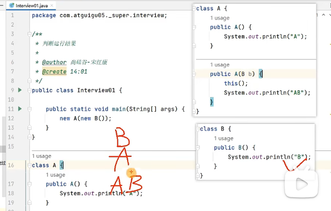

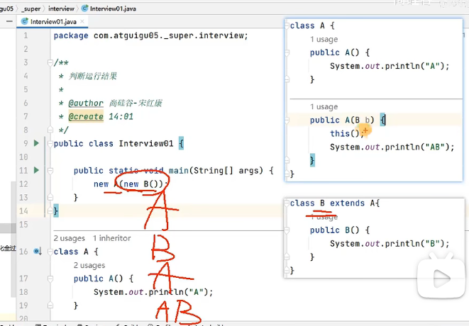


### 5.5多态

对象的多态性：父类的引用指向子类的对象

格式：(父类类型：指子类继承的父类类型，或者实现的接口类型)

`父类类型 变量名 = 子类对象`

举例：

```java
Person p = new Student();
Object o = new Person();//Object类型的变量o，指向Person类型的对象
o = new Student();//Object类型的变量o，指向Student类型的对象
```

#### 5.5.1多态性的应用：虚拟方法调用

在多态的场景下，调用方法时。

编译时，认为方法是左边声明的父类的类型的方法（即被重写的方法）

执行式，实际执行的是子类重写父类的方法。

简称：编译看左边，运行看右边

#### 5.5.2多态性的使用前提：

1. 要有类的继承关系
2. 要有方法的重写

#### 5.5.3多态的适用性

只适用于方法，不适用于属性

#### 5.5.4多态的好处与弊端

好处：变量引用的子类对象不同，执行的方法就不同，实现动态绑定。代码编写更灵活、功能更强大，可维护性和扩展性更好了。

弊端：一个引用类型变量如果声明为父类的类型，但实际引用的是子类对象，那么该变量就不能再访问子类中添加的属性和方法。

```
Student m = new Student();
m.school = "pku"; //合法，Student类有school成员变量
Person e = new Student();
e.school = "pku"; //非法，Person类没有school成员变量
//属性是在编译时确定的，编译时e为Person类型
```

> 开发中：
>
> 使用父类做方法的形参，是多态使用最多的场合。即使增加了新的子类，方法也无需改变，提高了扩展性，符合开闭原则。
>
> 【开闭原则OCP】
>
> - 对扩展开放，对修改关闭
> - 通俗解释：软件系统中的各种组件，如模块（Modules）、类（Classes）以及功能(Functions)等，应该在不修改现有代码的基础上，引发新功能

### 5.6向上转型与向下转型

#### 5.6.1为什么要类型转换

因为多态，就一定会有把子类对象赋值给父类变量的时候，这个时候，在编译期间，就会出现类型转换的现象。

但是，使用父类变量接收了子类对象之后，我们就不能调用子类拥有，而父类没有的方法了。这也是多态给我们带来的"小麻烦"。所以，想要调用子类特有的方法，必须做类型转换，使得编译通过

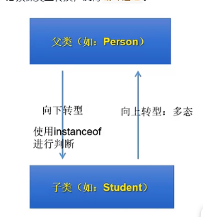

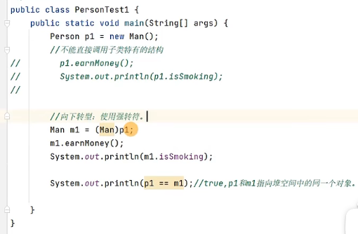

向下转型可能会出现：类型转换异常（ClassCastException）

```java
Person p2 = new Woman();
Man m2 = (Man)p2;//报错！
m2.earnMoney();
```

建议在向下转型之前，使用instanceof进行判断，避免出现类型转换异常

格式：`a instanceof A`:判断对象a是否是类A的实例

如果a instanceof A 返回 true，则：

​	a instance偶分 superA 返回也是true。其中，A，是superA的子类

```java
if(p2 instanceof Man){
	Man m2 = (Man)p2;
	m2.earnMoney();
}//进不去！
```

新特性：

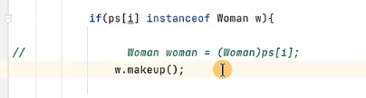

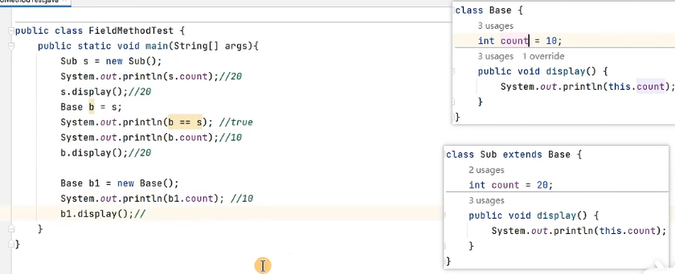

### 5.7Object类及clone(),finalize()的理解

默认的父类：

Java中声明的类，如果没有显式的声明其父类时，则默认继承于java.lang.Object

finalize()方法调用的时机：当GC要回收此对象时调用，子类重写此方法，可在释放对象前进行某些操作

finalize()可能导致内部出现循环引用，导致此对象不能被回收

### 5.8equals()方法的使用

自定义的类在没有重写Object中equals()方法的情况下，调用的就是Object类中声明的equals()，比较两个对象的引用地址是否相同。（或比较两个对象是否指向了堆空间中的同一个对象实体）

对于像String、File、Date和包装类等，它们都重写了Object类中的equals()方法，用于比较两个对象的实体内容是否相等


开发中使用说明：

- 实际开发中，针对于自定义的类，常常会判断两个对象是否equals()，而此时主要是判断两个对象的属性值是否相等。所以我们要重写Object类的equals()方法。
- 如何重写：
  - 手动自己实现
  - 调用IDEA自动实现（推荐）


面试题：equals():方法 和 == 

==：运算符

- 使用范围：基本数据类型，引用数据类型
- 基本数据类型：判断数据值是否相等

equals():方法

- 使用范围：只能使用在引用数据类型上

```java
public boolean equals(Object obj){
	if(this ==obj){
		return true;
	}
	if(obj instanceof Circle){
		Circle c = (Circle) obj;
		return this.radius == c.radius;
	}
	return false;
}
```


### 5.9toString()方法的使用

#### 5.9.1Object类中toString()的定义：

```java
public String toString(){
	return getClass().getname() + "@" + Integer.toHexString(hashCode());
}
```

#### 5.9.2开发中的使用场景

平时我们在调用System.out.println()打印对象引用变量时，其实就调用了对象的toString()

#### 5.9.3子类使用说明：

- 自定义的类，在没有重写Object类的toString(的情况下，默认返回的是)
- 像String、File、Date或包装类等Object的子类，它们都重写了Object类的toString()，在调用toString()时，返回当前对象的实体内容

#### 5.9.4开发中使用说明

习惯上，开发中对于自定义的类在调用toString()时，也希望显示其对象的实体内容，而非地址值。这时候就需要重写Object类中的toString()


```java
public class ToString {
    public static void main(String[] args){
        User u1 = new User("Tom",12);
        System.out.println(u1.toString());//User{ name = Tom, age = 12}
        System.out.println(u1);//User{ name = Tom, age = 12}
    }
}

class User{
    String name;
    int age;

    public User() {
    }

    public User(String name, int age) {
        this.name = name;
        this.age = age;
    }

    //手动实现toString()
    public String toString(){
        return "User{ name = "+ name +", age = " + age +"}";
    }
}

```


### 5.10小结

## 六.面向对象（高级）

### 6.1关键字static修饰属性、方法

#### 6.1.1static初步认识

1.static：静态的

2.static用来修饰的结构：属性、方法；代码块、内部类

```java
public class ChineseTest {
    public static void main(String[] args){
        Chinese c1 = new Chinese();
        c1.name = "姚明";
        c1.age = 40;
        c1.nation = "China";
        Chinese c2 = new Chinese();
        c2.name = "刘翔";
        c2.age = 39;
        System.out.println(c1);
        System.out.println(c2);
        System.out.println(c1.nation);//China
        System.out.println(c2.nation);//China
        
    }
}

class Chinese{
    //非静态变量、实例变量
    String name;
    int age;
    //静态变量、类变量
    static String nation;
    //手动实现toString()
    public String toString(){
        return "User{ name = "+ name +", age = " + age +"}";
    }
}

```

#### 6.1.2对比静态变量与实例变量

1. 个数
   - 静态变量：在内存空间中只有一份，被类的多个对象所共享
   - 实例变量：类的每一个实例（或对象）都保存着一份实例变量。
2. 内存位置
   - 静态变量：jdk6及之前，存在方法区。jdk7及以后，存放在堆空间
   - 实例变量：存放在堆空间的对象实体中
3. 加载时机
   - 静态变量：随着类的加载而加载，由于类只会加载一次，所以静态变量也只有一份
   - 实例变量：随着对象的创建而加载。每个对象拥有一份实例变量。
4. 调用者
   - 静态变量：可以被类直接调用，也可以使用对象调用
   - 实例变量：只能使用对象调用
5. 消亡时机
   - 静态变量：随着类的卸载而消亡
   - 实例变量：随着对象的消亡而消亡

#### 6.1.3static修饰方法：（类方法、静态方法）

- 随着类的加载而加载

- 可以通过“类.静态方法”的方式，直接调用静态方法

  - ```java
    public class ChineseTest {
        public static void main(String[] args){
            Chinese.show();
            Chinese c1 = new Chinese();
            c1.name = "姚明";
            c1.age = 40;
            c1.nation = "China";
            Chinese c2 = new Chinese();
            c2.name = "刘翔";
            c2.age = 39;
            System.out.println(c1);
            System.out.println(c2);
            System.out.println(c1.nation);//China
            System.out.println(c2.nation);//China
    
        }
    }
    
    class Chinese{
        //非静态变量、实例变量
        String name;
        int age;
        //静态变量、类变量
        static String nation;
        //手动实现toString()
        public String toString(){
            return "User{ name = "+ name +", age = " + age +"}";
        }
        public static void show(){
            System.out.println("我是一个中国人");
        }
    }
    
    ```

- 静态方法内可以调用静态的属性或静态的方法。（属性和方法的前缀使用的是当前类，可以省略）
  不可以调用非静态的结构。（比如：属性、方法），不可以调用非静态的结构

- 在类的非静态方法中，可以调用当前类的 静态结构（属性、方法）或非静态结构（属性、方法）

- static修饰的方法内，不能使用this和super

#### 6.1.4开发中，什么时候需要将属性声明为静态的？

- 判断当前类的多个实例是否能共享此成员变量，且此成员变量的值是相同的
- 开发中，常将一些常量声明是静态的。比如，Math类中的PI

什么时候需要将方法声明为静态的？

- 方法内操作的变量如果都是静态变量（而非实例变量）的话，则此方法建议声明为静态方法
- 开发中，常常将工具类中的方法，声明为静态方法。比如：Arrays类、Math类

### 6.2单例(Singleton)设计模式

#### 6.2.1设计模式概述

**设计模式**是在大量的**实践中总结**和**理论化**之后优选的代码结构、编程风格、以及解决问题的思考方式。设计模式免去我们自己再思考和摸索。就像是经典的棋谱，不同的棋局，我们用不同的棋谱。“套路”经典的设计模式共有23种。每个设计模式均是特定环境下特定问题的处理方法。

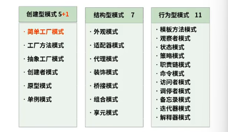

> 简单工厂模式并不是23种经典模式的一种，是其中工厂方法模式的简化版

#### 6.2.2何为单例模式

就是采取一定的方法保证在整个的软件系统中，对某个类**只能存在一个对象实例**，并且该类只提供一个取得其对象实例的方法。

#### 6.2.3实现思路

如果我们要让类在一个虚拟机中只能产生一个对象，我们首先必须将**类的构造器的访问权限设置为private**，这样，就不能用new操作符在类的外部产生类的对象了，但在类内部仍可以产生该类的对象。因为在类的外部开始还无法得到类的对象，**只能调用该类的某个静态方法**以返回内部创建的对象，静态方法只能访问类中的静态成员变量，所以指向内部产生的**该类对象的变量也必须定义成静态的**。

#### 6.2.4单例模式的两种实现方式

##### 6.2.4.1饿汉式

```java
public class BankTest {
    public static void main(String[] args){
        //Bank bank1 = new Bank();
        //Bank bank2 = new Bank();
        Bank bank1 = Bank.getInstance();
        Bank bank2 =  Bank.getInstance();
        System.out.println(bank1 == bank2);
    }
}

//饿汉式
class Bank{
    //1.类的构造器私有化
    private Bank(){

    }
    //2.在类的内部创建当前类的实例
    //4.此属性也必须声明为static的
    private static Bank instance = new Bank();

    //3.使用getXxx()方法获取当前类的实例，必须声明为static的
    public static Bank getInstance(){
        return instance;
    }
}
```

##### 6.2.4.2懒汉式

```java
public class GirlFriendTest {
}

//懒汉式
class GirlFriend{
    //1.类的构造器私有化
    private GirlFriend(){

    }

    //2.声明当前类的实例
    private static GirlFriend instance = null;

    //3.通过getXxx获取当前类的实例，如果未创建对象，则在方法内部进行创建
    public static GirlFriend getInstance(){
        if(instance == null){
            instance = new GirlFriend();
        }
        return instance;
    }
}
```

#### 6.2.5对比两种模式（特点、优缺点）

特点：

- 饿汉式：“立即加载”，随着类的加载，当前的唯一实例就创建了
- 懒汉式：“延迟加载”，在需要使用的时候。进行创建。

优缺点：

- 饿汉式：（优点）写法简单，由于内存中较早加载，使用更方便、更快。线程安全。（缺点）内存中占用时间较长。
- 懒汉式：（优点）在需要的时候创建，节省内存空间。（缺点）线程不安全

#### 6.2.6单例模式的优点及应用场景

由于单例模式只生成一个实例，减少了**系统性能开销**，当一个对象的产生需要比较多的资源时，如读取配置、产生其他依赖对象时，则可以通过在应用启动时直接产生一个单例对象，然后永久驻留内存的方式来解决。

应用场景：

- Windows的Task Manager（任务管理器）就是很典型的单例模式
- Windows的Recycle Bin（回收站）也是典型的单例应用。在整个系统运行的过程中，回收站一直维护着仅有的一个实例。
- Application也是单例的典型应用
- 应用程序的日志应用，一般都是使用单例模式实现，这一般是由于共享的日志文件一直处于打开状态，因为只能有一个实例去操作，否则内容不好追加
- 数据库连接池的设计一般也是采用单例模式，因为数据库连接是一种数据库资源

### 6.3代码块

1.代码块的作用：用来初始化类或对象的信息（即初始化类或对象的成员变量）

2.代码块的修饰：只能使用static进行修饰

3.代码块的分类：

静态代码块：使用static修饰

非静态代码块：没有使用static修饰

4.具体使用

静态代码块：

- 随着类的加载而执行
- 由于类的加载只会执行一次，进而静态代码块的执行，也只会执行一次
- 作用：用来初始化类的信息
- 内部可以声明变量、调用属性或方法、编写输出语句等操作。
- 静态代码块的执行要先于非静态的执行
- 如果声明有多个静态代码块，则按照声明的先后顺序执行
- 静态代码块内部只能调用静态的结构（即静态的属性、方法），不能调用非静态的结构（即非静态的属性、方法）

非静态代码块：

- 随着对象的创建而执行
- 每创建当前类的一个实例，就会执行一次非静态代码块
- 作用：用来初始化对象的信息
- 内部可以声明变量、调用属性或方法、编写输出语句等操作。
- 如果声明有多个静态代码块，则按照声明的先后顺序执行
- 非静态代码块内部可以调用静态的结构（即静态的属性、方法），也可以调用非静态的结构（即非静态的属性、方法）

```java
public class BlockTest {
}

class Person{
    String name;
    int age;
    public void eat(){
        System.out.println("人吃饭");
    }
    public Person(){}

    //非静态代码块
    {
        System.out.println("非静态代码块1");
    }

    //静态代码块
    static{
        System.out.println("静态代码块1");
    }
}
```

### 6.4类中属性赋值的位置及过程

1.可以给类的非静态属性（即实例变量）赋值的位置有：

（1）默认初始化

（2）显示初始化

（3）构造器中初始化

（5）代码块中初始化


（4）有了对象以后，通过“对象.属性”或“对象.方法”的方法进行赋值

2.执行的先后顺序：

① - ②/⑤ - ③ - ④

3.关于字节码文件中的<init>的简单说明：（通过插件jclasslib bytecode viewer查看）

- <init>方法在字节码文件中可以看到。每个<init>方法都对应着一个类的构造器。（类中声明了几个构造器就会有几个<init>)
- 编写的代码中的构造器在编译以后就会以<init>方法的方式呈现
- <init>方法内部的代码包含了实例变量的显示赋值、代码块中的赋值和构造器中的代码
- <init>方法用来初始化当前创建的对象的信息

4.给实例变量赋值的位置很多，开发中如何选？

显示赋值：比较适合于每个对象的属性值相同的场景

构造器中赋值：比较适合于每个对象的属性值不相同的场景

### 6.5final关键字的使用

1.final的理解：最终的

2.final可以用来修饰的结构：类、方法、变量

3.具体说明：

3.1final修饰类，表示此类不能被继承。

​	比如：String、StringBuffer、StringBuilder类

3.2final修饰方法，表示此方法不能被重写

​	比如:Object类中的getClass()

3.3final修饰变量：既可以修饰成员变量，也可以修饰局部变量。

​	此时的“变量”其实就变成了“常量”，意味着一旦赋值，就不可更改

​	3.3.1 final修饰成员变量：有哪些位置可以给成员变量赋值？

​		显式赋值

​		代码块中赋值

​		构造器赋值

​	3.3.2 final修饰局部变量，一旦赋值就不能修改

​		方法内声明的局部变量：在调用局部变量前，一定需要赋值，而且一旦赋值，就不可更改

​		方法的形参：在调用此方法时，给形参进行赋值。而且一旦赋值，就不可更改

4.final与static搭配：修饰成员变量时，此成员变量称为：全局常量。

​	比如：Math的PI

### 6.6抽象类与抽象方法（或abstract关键字）

1.abstract的概念：抽象的

2.abstract可以用来修饰：类、方法

3.具体的使用：

3.1 abstract修饰类：

-  此类称为抽象类
- 抽象类不能实例化
- 抽象类中包含构造器的，因为子类对象实例化时，需要直接或间接的调用到父类的构造器。
- 抽象类中可以没有抽象方法。反之，抽象方法所在的类，一定是抽象类

3.2 abstract修饰方法：

- 此方法即为抽象方法
- 抽象方法只有方法的声明，没有方法体。
- 抽象方法其功能是确定的（通过方法的声明即可确定），只是不知道如何具体实现
- 子类必须重写父类中所有的抽象方法之后，方可实例化。否则，此子类仍然是一个抽象类

4.abstract不能使用的场景：

4.1abstract不能修饰哪些结构？

属性、构造器、代码块等。

4.2abstract不能与哪些关键字共用？（自洽）

不能用abstract修饰私有方法、静态方法、final方法、final的类

- 私有方法不能重写
- 避免静态方法使用类进行调用
- final的方法不能被重写
- final修饰的类不能有子类

### 6.7接口的使用

1.接口的理解：接口的本质是契约、标准、规范，就像我们的法律一样，制定好后大家都要遵守

2.定义接口的关键字：interface

3.接口内部结构的说明：

- 可以声明：
  - 属性：必须使用public static final修饰
  - 方法：jdk8之前：声明抽象方法，修饰为public abstract
  - ​          jdk8：声明静态方法、默认方法
  - ​          jdk9：声明私有方法
- 不可以声明：构造器、代码块等

4.接口与类的关系：实现关系

5.格式：class A extends SuperA implements B,C{}

​	A相较于SuperA来讲叫做子类

​	A相较于B,C来讲，叫做实现类

6.满足此关系之后，说明：

- 类可以实现多个接口
- 类针对于接口的多实现，一定程度上就弥补了类的单继承的局限性
- 类必须将实现的接口中的所有抽象方法都重写（或实现），方可实例化。否则，此实现类必须声明为抽象类

7.接口与接口的关系：继承，且可以多继承

8.接口的多态性：接口名 变量名 = new 实现类对象

```java
public class USBTest {
    public static void main(String[] args){
        //1.创建接口实现类的对象
        Computer computer = new Computer();
        Printer printer = new Printer();
        computer.transferData(printer);
        //2.创建接口实现类的匿名对象
        computer.transferData(new Camera());
        System.out.println();
        //3.创建接口匿名实现类的对象
        USB usb1 = new USB(){
            public void start(){
                System.out.println("U盘开始工作");
            }
            public void stop(){
                System.out.println("U盘结束工作");
            }
        };
        computer.transferData(usb1);
        //4.创捷接口匿名实现类的匿名对象
        computer.transferData(new USB() {
            @Override
            public void start() {
                System.out.println("扫描仪开始工作");
            }

            @Override
            public void stop() {
                System.out.println("扫描仪结束工作");
            }
        });
    }
}
class Computer{
    public void transferData(USB usb){//多态：USB usb = new Printer();
        System.out.println("设备连接成功....");
        usb.start();
        System.out.println("数据传输的细节操作....");
        usb.stop();
    }
}

class Camera implements USB{
    public void start(){
        System.out.println("照相机开始工作");
    }
    public void stop(){
        System.out.println("照相机结束工作");
    }
}
class Printer implements USB{
    public void start(){
        System.out.println("打印机开始工作");
    }
    public void stop(){
        System.out.println("打印机结束工作");
    }
}
interface USB{
    //声明常量
    //USB的长、宽、高、...
    //方法
    public abstract void start();
    void stop();
}
```

9.面试题：区分抽象类和接口

- 共性：
  - 都可以声明抽象方法
  - 都不能实例化
- 不同：
  - 抽象类一定有构造器，接口没有构造器
  - 类与类之间继承关系，类与接口之间是实现关系，接口与接口之间是多继承关系	


## 七.异常处理

## 八.多线程

## 九.常用类与基础API

## 十.集合框架

## 十一.泛型

## 十二.数据结构与集合源码

## 十三.File类与IO流

## 十四.网络编程

## 十五.反射机制

## 十六.JDK8-17新特性

