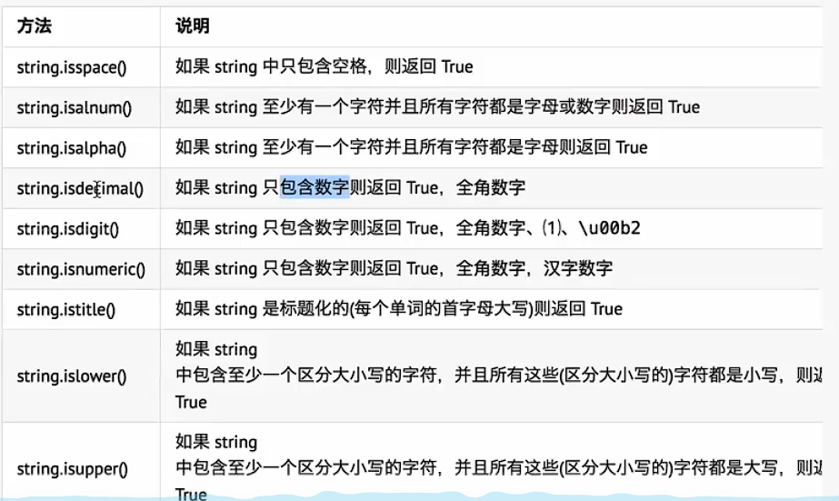
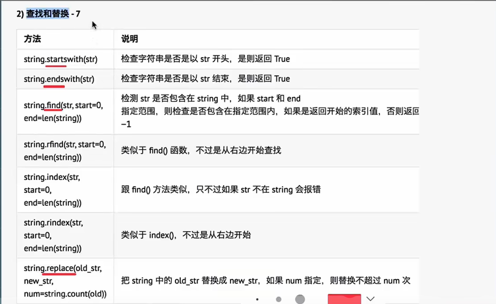
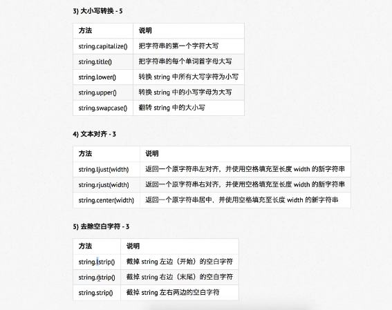
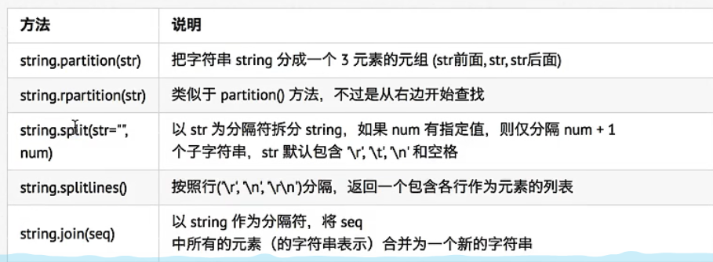
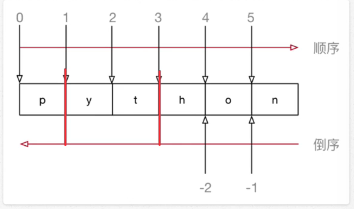
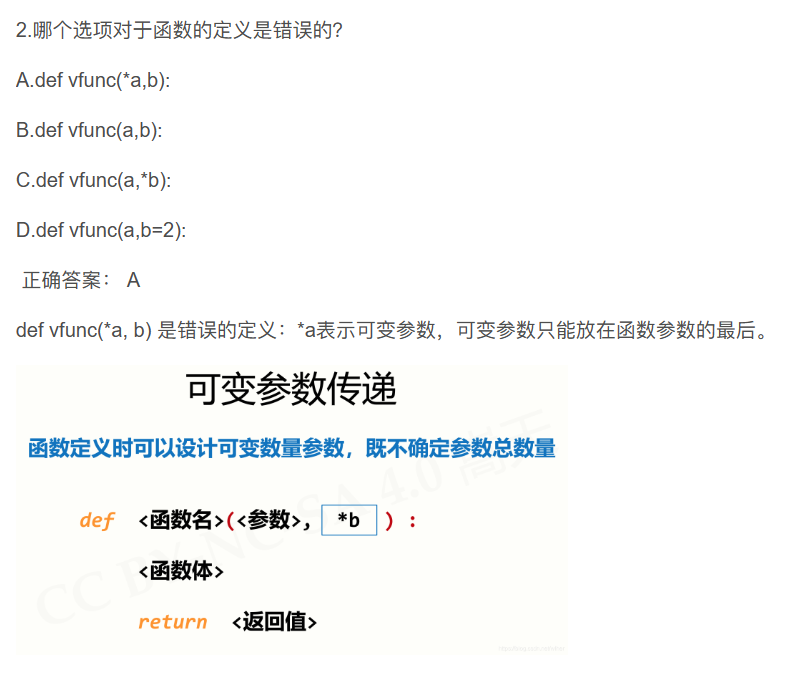

# Python

## 算术运算符

| 运算符 | 描述   | 实例       |
| ------ | ------ | ---------- |
| /      | 除     | 10/20==0.5 |
| //     | 取整除 | 9//2==4    |
| **     | 幂     | 2**3==8    |

- 在Python中`*`运算符还可以用于字符串，计算结果就是字符串重复指定次数的结果

  ```python
  print("-"*50)
  --------------------------------------------------
  ```

  

## 变量

python不用定义变量，且定义变量时不需要指定变量的类型

在运行的时候Python解释器会根据赋值语句等号右侧的数据自动推导出变量中保存数据的准确类型

### 变量的类型

- 数字型
  - 整型(int/long)
  - 浮点型(float)
  - 布尔型(bool)
    - ​	真(true)——非0数
      - ​	假(false)——0
      - 复数型(complex)
        - ​	主要用于科学计算，例如：平面场问题、波动问题、电容电感等问题
- 非数字型
  - 字符串
  - 列表
  - 元组
  - 字典

使用`type([name])`函数可以查看一个变量的类型

### 变量之间的计算

#### 字符串变量之间使用+拼接字符

```python
first_name = "三"
last_name = "张"
print(first_name+last_name)
```

结果：三张

#### 字符串变量可以和整数使用*重复拼接相同字符串

```python
first_name = "三"
last_name = "张"
print(last_name * 10)
```

结果：张张张张张张张张张张

#### 数字型变量和字符串之间不能进行其它计算

### 变量的输入输出

用户输入的**任何内容**Python都认为是一个**字符串**

`字符串变量 = input("提示信息：")`

#### 类型转换函数

`int(x)`将x转换为一个整数

`float(x)`将x转换到一个浮点数

#### 格式化输出

| 格式化字符 | 含义                                                         |
| ---------- | ------------------------------------------------------------ |
| %s         | 字符串                                                       |
| %d         | 有符号十进制整数，%06d表示输出的整数显示位数，不足的地方使用0补全 |
| %f         | 浮点数，%.02f表示小数点后只显示2位                           |
| %%         | 输出%                                                        |

语法格式如下：

`print("格式化字符串"%(变量1，变量2...))`

```python
name = "pxy"
print("我的名字叫%s，请多多关照" % name)
```

输出为：我的名字叫pxy，请多多关照

## 变量的命名

### 标识符和关键字

> 标识符就是程序员定义的**变量名、函数名**
>
> 名字需要有见名知义的效果

- 标识符可以由**字母、下划线**和**数字**组成
- 不能以**数字**开头
- **不能与关键字重名**

### 关键字

- 关键字就是在Python内部已经使用的标识符
- 关键字具有特殊的功能和含义
- 开发者不允许定义和关键字相同的名字的标识符

通过以下命令可查看Python的关键字

```python
import keyword
print(keyword.kwlist)
```

> ['False', 'None', 'True', 'and', 'as', 'assert', 'async', 'await', 'break', 'class', 'continue', 'def', 'del', 'elif', 'else', 'except', 'finally', 'for', 'from', 'global', 'if', 'import', 'in', 'is', 'lambda', 'nonlocal', 'not', 'or', 'pass', 'raise', 'return', 'try', 'while', 'with', 'yield']

## If基础

格式：

> if 要判断的条件:
>
> ​	条件成立时，要做的事情
>
> else:
>
> ​	条件不成立时，要做的事情

注意：

- 代码的缩进为一个tab键，或者4个空格——建议使用空格
- 在Python开发中，Tab和空格不要混用
- if 和 else 语句以及各自的缩进部分共同是一个完整的代码块

## 字符串

### 定义及基本使用

在python中可以使用**一对双引号**或者**一对单引号**定义一个字符串

但大部分引用都用双引号

如果字符串内部需要用`""`，可以使用`''`定义字符串

如果字符串内部需要用`''`，可以使用`""`定义字符串

遍历字符串：

```python
str = '我的外号是"大西瓜"'
for char in str:
    print(char)
```

输出结果：

我
的
外
号
是
"
大
西
瓜
"

### 长度、计数、位置方法演练

- 统计字符串长度：`len()`
- 统计某一个子字符串出现的次数:`[字符串名].count("[子字符串]")`
- 某一个子字符串出现的位置：`[字符串名].index("[子字符串]")`

```python
hello_str = "hello hello"
# 1.统计字符串长度
print(len(hello_str))#11
# 2.统计某一个子字符串出现的次数
print(hello_str.count("llo"))#2
print(hello_str.count("abc"))#0
# 3.某一个子字符串出现的位置
print(hello_str.index("llo"))#2
print(hello_str.index("abc"))#报错
```

### 常用方法

```python
space_str = " "
print(space_str.isspace())#True
space_str = " \t\n"
print(space_str.isspace())
space_str = "  a"#False
print(space_str.isspace())
```




### 







```python
poem_str = "登鹳雀楼\t 王之涣 \t 白日依山尽 \t \n 黄河入海流"
# 1. 拆分字符串
poem_list = poem_str.split()
print(poem_list)#['登鹳雀楼', '王之涣', '白日依山尽', '黄河入海流']
#2.合并字符串
#使用空格作为分隔符，拼接成一个整齐的字符串
result = " ".join(poem_list)
print(result)#登鹳雀楼 王之涣 白日依山尽 黄河入海流

```

### 字符串的切片

- 切片方法适用于字符串、列表、元组

  - 切片使用**索引值**来限定范围，从一个大的字符串中切出小的字符串

  - **列表**和**元组**都是有序的集合，都能够**通过索引值**获取到对应的数据

  - 字典是一个**无序**的集合，是使用**键值对**保存数据

  - 

  - > 字符串[开始索引:结束索引:步长]

```python
num_str = "0123456789"
#1.截取从 2 - 5 位置 的字符串
print(num_str[2:6])
#2.截取从 2 - 末尾 的字符串
print(num_str[2:])
#3.截取从 开始 - 5 位置 的字符串
print(num_str[:6])
#4.截取完整的字符串
print(num_str[:])
#5.从开始位置，每隔一个字符截取字符串
print(num_str[::2])
#6.从索引1开始，每隔一个取一个
print(num_str[1::2])
#7.截取从 2 - 末尾 - 1 的字符串
print(num_str[2:-1])
#8.截取字符串末尾两个字符
print(num_str[-2:])
#9.字符串的逆序
print(num_str[-1::-1])
```

## 函数

### 定义

> def 函数名 (传入参数):
>
> ​	函数体
>
> ​	return 返回值

注意事项：

- 函数定义中的参数，称之为形式参数
- 函数调用中的参数，称之为实际参数

无返回值则返回None

### 函数的说明文档

> ```
> def func(x, y):
> """
> 函数说明
> :param x:形参x的说明
> :param y:形参y的说明
> 函数体
> :return 返回值
> ```

通过多行注释的形式，对函数进行说明解释

### 练习


