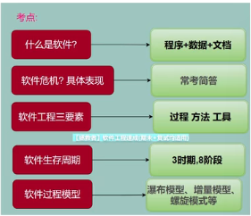
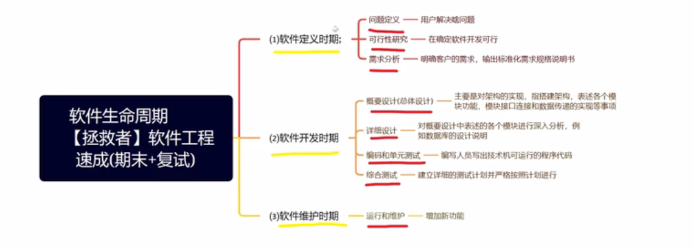
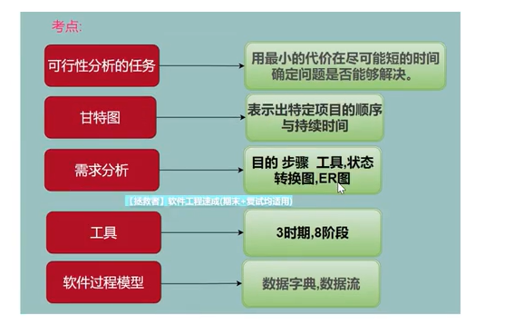
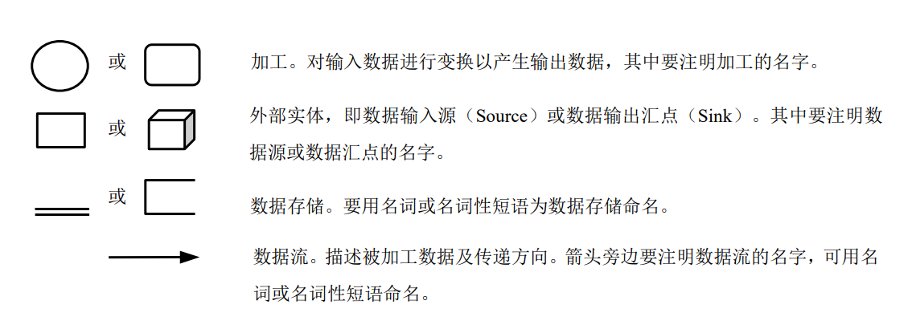
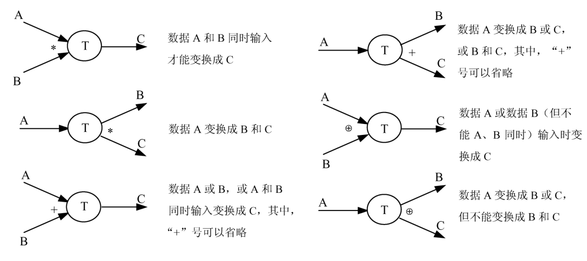
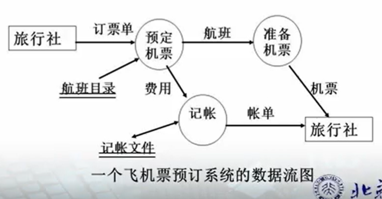
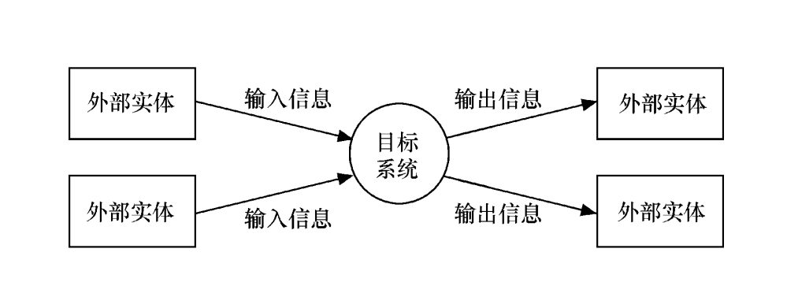

# 软件工程

## 一.概述

### 1.1软件

​	软件是计算机系统与硬件相互依存的另一部分，它包括程序、数据及文档的完整集合。

数据：是使程序能够适当处理信息的数据结构

程序：是能够完成预定功能和性能的可执行指令序列

文档：是开发、使用和维护过程程序所需要的图文资料

特点：

1. 软件是一种逻辑实体。软件是抽象的、无形的、没有物理实体
2. 软件是人类智力产品。
3. 软件开发过程复杂
4. 软件需要长期维护
5. 软件成本昂贵
6. 软件可以复制

### 1.2软件危机

#### 1.2.1概念：

在计算机软件开发和维护过程所遇到的一系列严重问题。

**包含两方面内容：**

1.如何开发软件，以满足对软件日益增长的需求

2.如何维护数量不断膨胀的已有软件

#### 1.2.2**软件危机的表现：**

> 对软件开发成本和进度估算不准确用户对已完成软件不满意
>
> 软件质量不可靠
>
> 没有适当文档资料
>
> 软件不可维护
>
> 软件成本在计算机系统中所占比例逐年上升
>
> 软件开发生产率低

**原因：**

> （1）用户需求不明确
>
> （2）缺乏正确的理论直到
>
> （3）软件开发规模越来越大
>
> （4）软件开发复杂度越来越高

#### 1.2.3**消除软件危机的途径：**

> 1. 对计算机软件应该有正确的认识
> 2. 吸收借鉴人类长期从事各种工程项目积累的原理、概念、技术和方法
> 3. 积极开发和使用计算机辅助开发工具
> 4. 探索更好更有效的管理措施和手段对开发过程进行控制和管理

### 1.3软件工程

#### 1.3.1**定义：**

​	采用工程的概念、原理、技术和方法来开发和维护软件，把经过时间考验而证明正确的管理技术和当前能够得到的最好的技术方法结合起来，经济的开发出高质量的软件并维护它。

#### 1.3.2 **3个要素：**

方法、工具和过程

方法：完成软件开发各项任务的技术方法，回答“怎么做”

工具：为运用方法提供的自动或半自动软件工程支撑环境

过程：是为了获得高质量软件所需要完成的一系列任务框架，回答啥时候做

#### 1.3.3 **软件生命周期：**

​	软件开始研制到最终软件废弃不用所经历的各个阶段

​	3时期、8阶段

1. 软件定义时期
   - 问题定义 —— 用户解决什么问题
   - 可行性研究 —— 在确定软件开发可行
   - 需求分析 —— 明确客户的需求，输出标准化需求规格说明书
2. 软件开发时期
   - 概要设计（总体设计）—— 主要是对架构的实现。指搭建构架，表述各个模块的功能，模块接口连接和数据传递的实现等现象
   - 详细设计 —— 对概要设计中表述的各个模块进行深入分析，例如数据库的设计说明
   - 编码和单元测试 —— 编写人员写出技术机可运行的程序代码
   - 综合测试 —— 建立详细的测试计划并严格按照计划进行
3. 软件维护时期 —— 运行和维护 —— 增加新功能

### 1.4软件过程：

​	是为了获得高质量软件所需要完成的一系列任务框架。通常用软件生命周期模型描述软件工程。

主要包括：

瀑布模型、增量模型、螺旋模型、喷泉模型其他模型

#### 1.4.1瀑布模型

​	是将软件生存周期中的各个活动规定为**依线性顺序连接的若干阶段的模型**，包括需求分析、设计、编码、测试、运行与维护。它规定了由前至后、相互衔接的固定依次，如同瀑布流水逐级下落。

瀑布模型的有

- 软件的基础模型：瀑布模型
- 软件生命周期中花费最多的阶段：软件维护
- - 维护是软件生命周期的最后一个阶段，也是持续时间最长、花费代价最大的一个阶段
- 综合测试是在软件周期的（）阶段制定的，在综合测试完成的
  - 概要设计
  - 

### 二.可行性分析与需求分析

### 可行性分析任务

用最小的代价在最小的时间内确定问题是否能够解决。

### 可行性研究

### 甘特图

### 数据流图DFD

#### 基本图形元素

#### 多个数据流之间的关系

#### 数据流图画法

### 环境图

- 环境图（context diagram）也称为顶层数据流 图（或0层数据流图），它仅包括一个数据处理过程，也就是要开发的目标系统。
- 环境图的作用是确定系统在其环境中的位置，通 过确定系统的输入和输出与外部实体的关系确定其边界。

例子：

